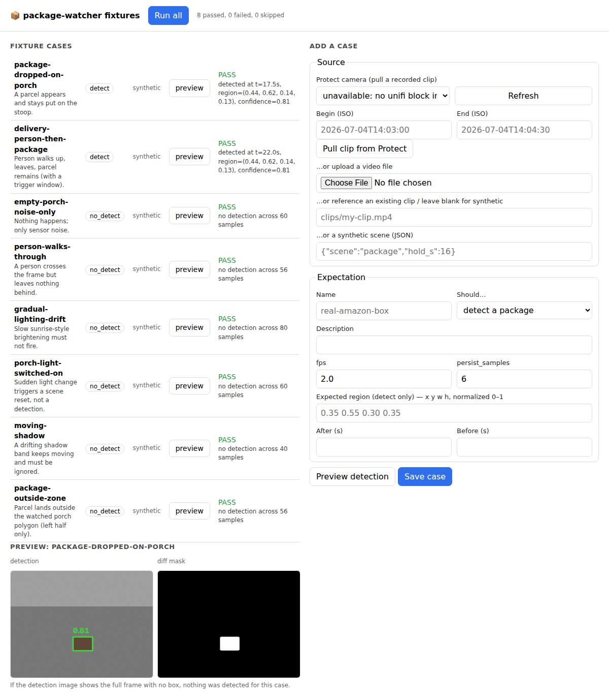

# package-watcher

CPU-only package detection for fixed [Unifi Protect](https://ui.com/camera-security)
cameras. It watches RTSP streams with a rolling background model and reports
when **something new shows up in frame and stays there** — the signature of a
package being set down. Every report says *where* (pixel and normalized
coordinates) and *why* (an evidence bundle: annotated frame, close-up crop,
pre-object baseline, and the diff mask that drove the call), so a downstream
LLM — or a human — can verify the detection.

No GPU, no neural networks, no cloud. Just OpenCV arithmetic at ~1 fps per
camera.

## Why a standalone service (and not a Home Assistant integration)?

Continuous frame decoding + pixel math is sustained CPU work, which is a poor
fit for Home Assistant's Python event loop. So the core is a plain Python
service you can run anywhere (bare `pip`, Docker, or as the included
**Home Assistant add-on**, which runs it in its own container). Events flow
back into HA or anything else via a webhook or the JSONL log.

## How detection works (the part that matters)

For each camera we keep **two exponential running averages** of the
downscaled, blurred, grayscale scene:

- a **fast background** (`fast_alpha ≈ 0.15`) that adapts within ~10 samples
- a **slow background** (`slow_alpha ≈ 0.004`) that takes minutes to adapt

Each sampled frame is compared against both:

| differs from slow bg | differs from fast bg | interpretation |
|---|---|---|
| no | no | nothing happening |
| yes | yes | something **moving** (person, car, dog) — ignored |
| **yes** | **no** | something **appeared recently and stopped moving** ← package |

Blobs in that `slow-and-not-fast` mask are size-filtered, matched frame to
frame (IoU tracking), and only reported after persisting for
`persist_samples` consecutive samples (~8 s at 1 fps). Extra guards:

- **Scene-change reset** — if >35% of the frame changes at once (lights
  toggle, exposure jump, camera bump), the models re-seed instead of
  reporting the whole world as new.
- **Gradual drift immunity** — sunrise/sunset tracks into both backgrounds
  and never fires.
- **Re-arming** — a reported object is eventually absorbed ("healed") into
  the slow background, so a second package next to the first still fires.
- **Zones** — optional normalized polygon per camera (watch the porch,
  ignore the street).

### Triggers (Unifi Protect smart detections)

Protect's NVR already does person/vehicle detection on-device. With the
optional `unifi` config block, the watcher subscribes to those events over
the Protect websocket (via [`uiprotect`](https://github.com/uilibs/uiprotect))
and treats them as **attention signals**: for `attention_seconds` after a
person is seen, the persistence bar drops (`persist_samples_triggered`),
because a new stationary object right after a person at the door is very
likely a delivery. Triggers are an accelerant, not a requirement — the
rolling window catches drop-offs even when no trigger fires.

### Showing its work

Every event is a self-describing JSON payload plus an evidence directory:

```
events/front-door/front-door-20260706T171502Z-3/
├── event.json      # everything below, machine-readable
├── annotated.jpg   # full frame, region outlined + confidence label
├── crop.jpg        # close-up of the region (with margin)
├── baseline.jpg    # what that spot looked like BEFORE the object appeared
├── mask.png        # the binary diff mask that produced the blob
└── raw.jpg         # untouched frame at report time
```

```json
{
  "id": "front-door-20260706T171502Z-3",
  "kind": "new_static_object",
  "camera": "front-door",
  "first_seen": "2026-07-06T17:14:54+00:00",
  "reported_at": "2026-07-06T17:15:02+00:00",
  "samples_persisted": 8,
  "frame_size": {"width": 1920, "height": 1080},
  "bbox_pixels": {"x": 812, "y": 743, "w": 174, "h": 121},
  "bbox_normalized": {"x": 0.4229, "y": 0.688, "w": 0.0906, "h": 0.112},
  "signals": {"area_fraction": 0.0102, "contrast": 0.211, "confidence": 0.78},
  "trigger": {"kind": "person", "source": "unifi-protect", "at": "2026-07-06T17:14:31+00:00"},
  "evidence": {"annotated": "front-door/.../annotated.jpg", "crop": "...", "...": "..."},
  "llm_verification": {"suggested_prompt": "A CPU-based motion watcher believes a new stationary object appeared..."}
}
```

The `llm_verification.suggested_prompt` plus `annotated.jpg`/`crop.jpg`/
`baseline.jpg` is everything a vision LLM needs to answer *"is this actually
a package?"* — that verification step is intentionally left as a separate,
pluggable stage (webhook → your LLM of choice).

`confidence` is an honest heuristic, not a learned score: persistence is
already satisfied at report time, so it blends the region's contrast against
the pre-object background with a mild package-sized-blob prior. Treat it as
a ranking signal for the verifier, not a probability.

## Quick start

```bash
pip install ".[unifi]"          # or plain `pip install .` without triggers
cp config.example.yaml config.yaml   # add your rtsps:// URLs
package-watcher run --config config.yaml
```

Get the RTSP URL from Protect: camera → Settings → Advanced → enable an RTSP
stream, copy the `rtsps://…:7441/…` URL. 720p/1080p substreams are ideal —
frames are downscaled to `resize_width` (default 640 px) anyway.

Try it on a recorded clip first (great for tuning):

```bash
package-watcher analyze porch-clip.mp4 --fps 2 --out ./events
```

### Docker

```bash
docker build -t package-watcher .
docker run -v $(pwd)/data:/data package-watcher   # expects /data/config.yaml
```

### Home Assistant add-on

Add this repository URL under **Settings → Add-ons → Add-on store → ⋮ →
Repositories**, install *Package Watcher*, start it once to generate a
starter config in the add-on's config folder, edit it, restart. Point
`sinks.webhook_url` at a HA webhook to drive automations.

The add-on runs the watcher **and** the fixture-authoring UI in one container:
the UI is exposed through Home Assistant **ingress**, so it shows up as a
*Package Watcher* item in the sidebar (open the add-on → *Open Web UI*) with no
extra port to forward or authenticate. The detection service starts
automatically once you've replaced the placeholder camera in the config;
until then only the UI comes up, so you can author fixtures right away.
Fixtures are written to `fixtures_path` (default `/config/fixtures`) in the
add-on config folder and persist across restarts.

## Configuration

See [`config.example.yaml`](config.example.yaml) — every knob is commented.
The ones that matter most:

| key | default | meaning |
|---|---|---|
| `cameras[].sample_fps` | 1.0 | analysis rate; CPU scales linearly with this |
| `detector.persist_samples` | 8 | how long an object must stay put before reporting |
| `detector.diff_threshold` | 18 | pixel delta considered "changed" — raise if noisy |
| `detector.min/max_area_frac` | 0.0008 / 0.25 | blob size gates |
| `unifi.attention_seconds` | 120 | attention window after a person trigger |

## Integration tests & the fixture authoring UI

Beyond the unit tests, there is a **data-driven integration suite**: a
manifest of *fixture cases*, each a clip plus an expectation — "this should
detect a package" or "this should NOT" — that the detector is graded against.
A clip is either a real video file (`clips/…`) or a **synthetic, seeded
scenario** so the suite runs in CI with no committed video.

```bash
pytest tests/test_fixtures.py         # grade every case
package-watcher test --fixtures fixtures   # same, human-readable output
```

```
PASS package-dropped-on-porch: detected at t=17.5s, region=(0.44, 0.62, 0.14, 0.13), confidence=0.81
PASS person-walks-through: no detection across 56 samples
PASS porch-light-switched-on: no detection across 60 samples
...
```

Cases live in [`fixtures/cases.yaml`](fixtures/cases.yaml). A `detect` case
can further require the detection to overlap an expected `region` (normalized
`x y w h`), fall inside a time window (`after`/`before`), or cap `max_reports`.
`attention` windows simulate Protect triggers so the triggered code path is
graded deterministically.

### Authoring fixtures from real footage (the UI)

```bash
pip install ".[ui,unifi]"
package-watcher ui --config config.yaml --fixtures fixtures   # http://127.0.0.1:8080
```

The web UI lets you build fixtures from real cameras without touching YAML:

1. **Grab a clip** — pick a Protect camera, choose a start time and window,
   and **scrub a thumbnail timeline** (cheap downscaled snapshots, no video
   download) to find the moment; click a frame for the **In** point and
   another for **Out**, *Zoom to selection* to refine, then pull just that
   short range as the clip. Or upload a local file, or point at an existing
   clip. When running as the Home Assistant add-on, the camera list is
   populated automatically from your HA `camera.*` entities, and Protect NVR
   credentials are reused from the HA UniFi Protect integration — so scrubbing
   and clip pull work with no `unifi` block. (Non-Protect HA cameras have no
   recorded backend, so for those upload footage or reference a clip.)
2. **Label it** — "should detect" / "should NOT", optional expected region and
   time window.
3. **Preview** — runs the detector and shows what it found (annotated frame +
   diff mask) so you can confirm/tune before saving.
4. **Save** — appends the case to `cases.yaml`; `pytest` grades it thereafter.

"Run all" grades every case inline with pass/fail and the reason:



## Development

```bash
pip install -e ".[dev]"
pytest
```

The unit suite renders synthetic porch footage (noise, lighting drift,
passersby, package drops) and asserts the detector fires exactly once, at
the right coordinates, and stays quiet otherwise — including a full
video-file → service → evidence-bundle end-to-end test. The integration
suite (above) grades the detect/no-detect fixture matrix.

## Roadmap

- Built-in LLM verification stage (send evidence to a vision model, attach verdict)
- MQTT sink for native HA discovery
- Auto-discovery of cameras/RTSP URLs via the Protect API
- Removal events ("the package that appeared at X is gone")
